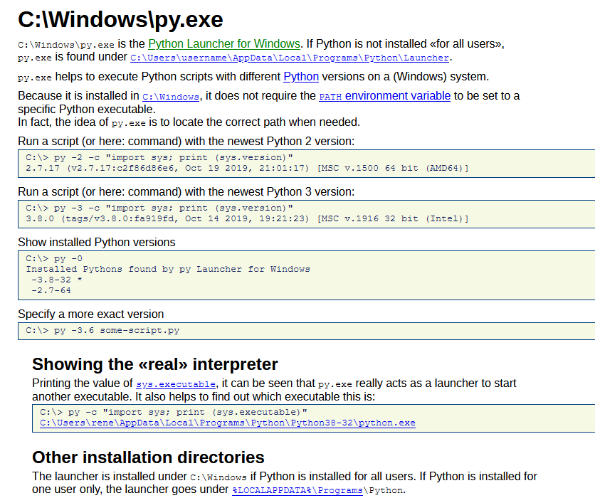

# Tips and Tricks

## 1.  **Py.exe**
We can find the version of python interpreter installed on a Windows system and we can as well run some custom scripts by choosing the version of the interpreter installed.

[Link for more info](https://renenyffenegger.ch/notes/Windows/dirs/Windows/py_exe)

## 2.  **Case of Boolean Logic**

We can evaluate the boolean logic in python in different ways, however there are some quirks. Python evaluates boolean logic from *left to right*.
1. In case of **OR**, we always output the *first True* and if the statement is False, we will output the *last False* that is evaluated by the interpreter. We can rephrase it by saying, the operand that is after the *OR* operator will be produced as output in case of False. 
2. In case of **AND**, we will output the *first False* and if the statement is True, we will output the *last True* that is evaluated. We can rephrase it by saying, the operend that is before the *AND* operator will be produced as output in case of FALSE.

	*Note*:- *First True* and *First False*, Assumes the boolean operation either have only **OR** operator or **AND** operator.